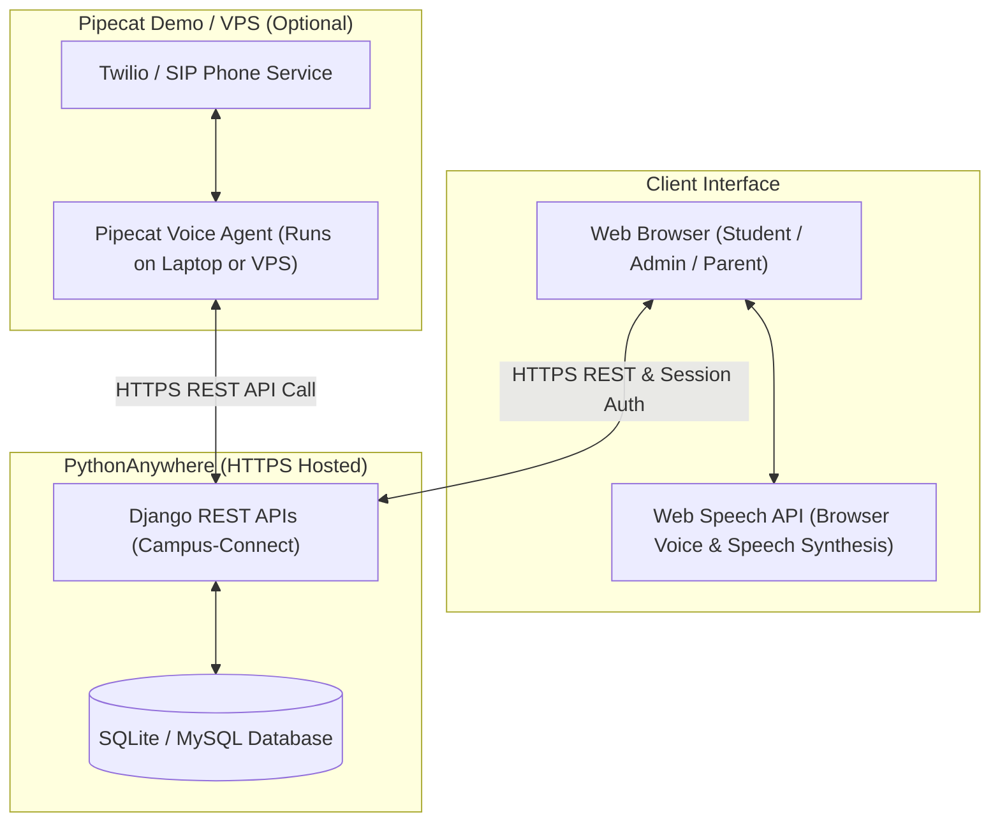

# Campus-Connect (formerly Coaching Center Management System) - Implementation Plan

The project is evolving into **Campus-Connect**, an integrated AI-powered campus and institute management platform featuring attendance tracking (via QR codes & facial verification), student/batch administration, fee management, and an AI voice assistant workflow.

---

## User Review Required

> [!IMPORTANT]
> - **Project Renaming**: Updating all user interface elements, titles, headers, WSGI configurations, and documentation from "St. Anthony Coaching Center" to **Campus-Connect**.
> - **Voice AI Architecture Clarification (Pipecat vs. PythonAnywhere)**:
>   - **Pipecat** is an open-source Python framework for low-latency real-time voice agents (STT -> LLM -> TTS). However, Pipecat requires a continuously running event loop / process (e.g. VPS, local computer, or dedicated cloud VM). It **cannot run as a 24/7 process on PythonAnywhere free/basic plans** (which only support WSGI HTTP request-response handlers).
>   - **Recommended Approach for Campus-Connect**:
>     1. **Browser-Based Voice AI (Web Speech API / WebAudio)**: Runs directly in the browser on PythonAnywhere without requiring extra server hosting or credits!
>     2. **Pipecat Demo Mode**: Run Pipecat on your local machine during project live demos. Pipecat connects directly to your hosted Campus-Connect Django REST APIs on PythonAnywhere via HTTPS.

---

## Open Questions

- None at the moment. The renaming and technical options are clear.

---

## Proposed Changes

### 1. Rebranding & Renaming to Campus-Connect

Update branding, titles, and headers across templates, configuration, and documentation.

#### [MODIFY] [base.html](file:///c:/Users/Maria%20Kevin/OneDrive/Desktop/Campus-Connect/templates/coaching/base.html)
- Change `<title>` block default from `St. Anthony Coaching Center` to `Campus-Connect`.
- Update sidebar brand text from `St. Anthony Coaching Center` to `Campus-Connect`.

#### [MODIFY] [login.html](file:///c:/Users/Maria%20Kevin/OneDrive/Desktop/Campus-Connect/templates/coaching/login.html)
- Change `<title>` block from `St. Anthony Coaching Center - Sign In` to `Campus-Connect - Sign In`.
- Update `<h1>` title heading to `Campus-Connect`.
- Update push notification title from `St. Anthony Portal` to `Campus-Connect Portal`.

#### [MODIFY] [print_qr.html](file:///c:/Users/Maria%20Kevin/OneDrive/Desktop/Campus-Connect/templates/coaching/print_qr.html)
- Update printable student card school name from `St. Anthony` & `Coaching Center` to `Campus-Connect`.

#### [MODIFY] [README.md](file:///c:/Users/Maria%20Kevin/OneDrive/Desktop/Campus-Connect/README.md)
- Update project documentation heading and description to `Campus-Connect`.

#### [MODIFY] [wsgi_pythonanywhere.py](file:///c:/Users/Maria%20Kevin/OneDrive/Desktop/Campus-Connect/wsgi_pythonanywhere.py)
- Update file header comments to `Campus-Connect`.

---

### 2. Voice AI System Architecture for Campus-Connect

---

## Verification Plan

### Automated Tests
- Run Django system checks: `python manage.py check`.
- Run Django test suite: `python manage.py test`.

### Manual Verification
- Verify title bar and sidebar header render "Campus-Connect".
- Verify login screen displays "Campus-Connect".
- Verify printable QR cards render "Campus-Connect".
